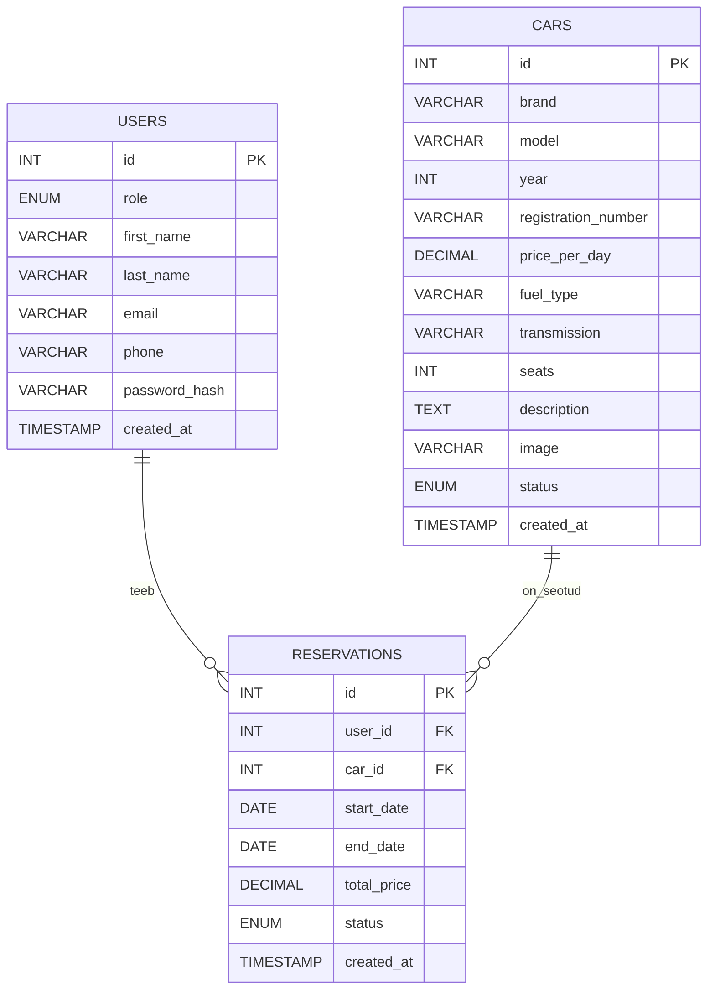

# Autorent

Autorent on PHP ja MySQL/MariaDB abil tehtud veebirakendus, kus kasutaja saab autosid vaadata, otsida ja broneerida.

Administraator saab autosid lisada, muuta ja kustutada ning admini vaated on kaitstud sisselogimisega.

## Käivitamine

Klooni projekt:

```bash
git clone https://github.com/Marteeowo/autorent.git
```

Liigu projekti kausta ja käivita Docker:

```bash
docker-compose up -d
```

Rakendus avaneb aadressil:

```text
http://localhost:8080
```

Andmebaasi SQL fail asub siin:

```text
db/cars_rent.sql
```

## Funktsioonid

### Autod

- autode kuvamine andmebaasist
- autode otsimine margi ja mudeli järgi
- lehekülgede kaupa kuvamine
- eraldi detailvaade igale autole

Detailvaade avaneb auto ID järgi, näiteks:

```text
auto.php?id=5
```

### Broneerimine

Registreeritud kasutaja saab valida autole rendiperioodi.

Broneeringu tegemisel:

- valitakse algus- ja lõppkuupäev
- arvutatakse rendi koguhind
- kontrollitakse, et sama auto broneeringud ei kattuks

Kui auto on valitud perioodil juba broneeritud, uut broneeringut ei salvestata.

### Admin

Administraator saab:

- autosid lisada
- autode andmeid muuta
- autosid kustutada
- vaadata olemasolevat autoparki

Admini lehed kasutavad sessiooni ning ilma sisselogimata neile ligi ei pääse.

## Tehnoloogiad

- PHP 8.x
- PHP `mysqli`
- MySQL / MariaDB
- Bootstrap 5
- HTML / CSS
- PHP sessioonid
- Bcrypt
- Prepared Statements

## Andmebaas

Rakendus kasutab kolme põhilist tabelit:



## Admini testkonto

```text
Kasutajanimi: admin
Parool: Passw0rd
```
